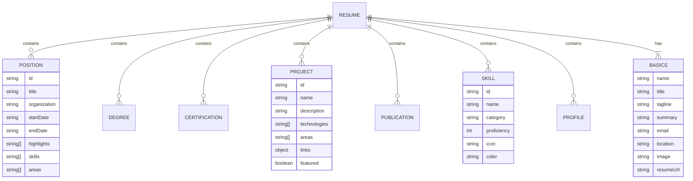
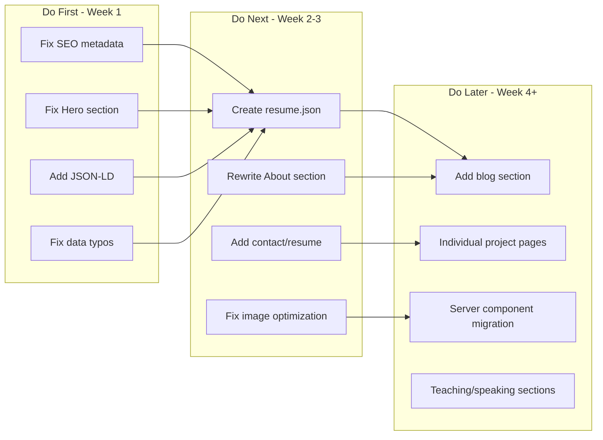

# amrabed.com — Comprehensive Website Audit & Improvement Plan

## Executive Summary

Your website is a well-structured Next.js 16 single-page portfolio with Tailwind CSS 4, HeroUI 3, an AI chat assistant (Miro), Framer Motion animations, and a unified filtering system. It already has good bones — but it significantly **under-represents** your experience and has meaningful gaps in SEO, data architecture, content depth, and UX.

> [!IMPORTANT]
> The core issue: your data is hardcoded in `.tsx` files, making maintenance painful and preventing many SEO/content strategies. A centralized data model is the single highest-impact change.

---

## 🔍 Current State Analysis

### What's Working Well ✅
- **Modern stack**: Next.js 16, Tailwind v4, HeroUI 3, Vitest, pnpm
- **AI Chat widget** (Miro) with Gemini — a unique differentiator
- **Cross-filtering** by area, skill, and role across sections
- **Accessibility basics**: Skip-to-content link, aria labels, focus rings
- **Dark mode** with smooth transitions
- **Google Analytics** integration
- **robots.ts + sitemap.ts** present
- **TypeAnimation** hero with rotating titles
- **Code quality**: ESLint, Prettier, Vitest with coverage

### What's Missing or Broken ❌

| Category | Issue | Impact |
|----------|-------|--------|
| **SEO** | Title is just "Amr Abed" — no role/keywords | 🔴 Critical |
| **SEO** | Description is "Amr Abed's personal website" — zero value | 🔴 Critical |
| **SEO** | Keywords meta is `"Amr Abed, personal website, portfolio, resume"` — generic | 🔴 Critical |
| **SEO** | OG description repeats the same useless text | 🔴 Critical |
| **SEO** | No structured data (JSON-LD) — invisible to Google Knowledge Graph | 🔴 Critical |
| **SEO** | Single-page app = all content on `/` — no deep-linkable pages | 🟡 High |
| **SEO** | `images.unoptimized: true` in next.config — no image optimization | 🟡 High |
| **Content** | Hero section has NO name display, no tagline, no summary | 🔴 Critical |
| **Content** | About section is 3 generic paragraphs — no personality or specifics | 🟡 High |
| **Content** | No blog/articles section despite having a Medium and LinkedIn articles | 🟡 High |
| **Content** | No contact form or email link on the site | 🟡 High |
| **Content** | No downloadable resume/CV link | 🟡 High |
| **Content** | Dissertation/thesis details are sparse | 🟢 Medium |
| **Content** | Commented-out "Abed Solutions" founder position — hidden experience | 🟢 Medium |
| **Data** | All data hardcoded in `.tsx` files mixing JSX icons with data | 🔴 Critical |
| **Data** | No centralized data model — scattered across 10+ files | 🔴 Critical |
| **Data** | Inconsistent key naming (`"machine learning"` vs `"Machine learning"` vs `"Machine Learning"`) | 🟡 High |
| **Data** | `skills` referenced by name strings with case-sensitivity issues | 🟡 High |
| **Data** | Project `tools` don't always match `skills` keys (e.g., `"Pyhton"` typo) | 🟡 High |
| **UX** | Hero shows only "I'm a/n Engineer" — no name "Amr Abed" visible! | 🔴 Critical |
| **UX** | No visible tagline like "PhD · Engineering Manager · AWS Certified" | 🟡 High |
| **UX** | Social links only in footer — not easily discoverable | 🟡 High |
| **UX** | No CTA (call-to-action) buttons anywhere | 🟡 High |
| **UX** | Education section ID is `degrees` but header link says "Education" | 🟢 Medium |
| **Perf** | `"use client"` on `page.tsx` — the entire page is client-rendered | 🟡 High |
| **Perf** | Framer Motion loaded for the entire page | 🟢 Medium |
| **Perf** | `mongoose` in dependencies but appears unused for the static site | 🟢 Medium |

---

## 🏗️ Recommended Architecture: Data-Driven Rewrite

### New Data Model (JSON-based, framework-agnostic)

Move all content to `src/data/*.json` files (or a single `resume.json`), following an extended [JSON Resume](https://jsonresume.org/) schema. This enables:

1. **Single source of truth** — edit one file, everything updates
2. **Resume PDF generation** — from the same data
3. **AI chat context** — feed JSON directly to Miro
4. **CMS integration** — later swap JSON for Notion/CMS if desired
5. **Type safety** — generate TypeScript types from the schema



### Proposed File Structure
```
src/
├── data/
│   └── resume.json          ← Single source of truth
├── types/
│   └── resume.ts            ← Auto-generated from schema
├── lib/
│   ├── data.ts              ← Data loading + icon mapping
│   └── seo.ts               ← JSON-LD generators
├── app/
│   ├── layout.tsx            ← Server component (JSON-LD injection)
│   ├── page.tsx              ← Server component wrapper
│   ├── blog/                 ← NEW: Blog pages (SSG from Medium/LinkedIn)
│   │   └── [slug]/page.tsx
│   ├── projects/             ← NEW: Individual project pages
│   │   └── [id]/page.tsx
│   └── api/chat/route.ts
├── components/
│   ├── sections/             ← Presentational only (no data imports)
│   └── ui/                   ← Shared UI primitives
```

---

## 📋 Improvement Plan — Phased Execution

### Phase 1: Critical SEO & Content Fixes (Quick Wins)

1. **Fix metadata** in `layout.tsx`:
   ```ts
   title: "Amr Abed — Engineering Manager | PhD, AWS Certified | AI & Cloud",
   description: "Software engineer and cloud architect with PhD from Virginia Tech. Engineering Manager at Sophi specializing in AI/ML, AWS, and scalable systems. Ex-Google intern. 5 AWS certifications.",
   keywords: "Amr Abed, software engineer, engineering manager, machine learning, AWS certified, cloud architect, Virginia Tech PhD, Sophi, AI, MLOps"
   ```

2. **Add JSON-LD structured data** (Person + WebSite schemas) for Google Knowledge Graph
3. **Fix Hero section**: Add your name, a professional tagline, social links, and a CTA
4. **Fix About section**: Replace generic text with specific achievements and personality
5. **Add canonical URL** and proper OG image with dimensions
6. **Fix data typos**: `"Pyhton"` → `"Python"`, normalize case for all tag/skill references

### Phase 2: Data Model Migration

7. **Create `resume.json`** — consolidate all data files into one JSON source
8. **Create icon/color mapping** — separate visual config from data
9. **Remove `.tsx` data files** — replace with pure JSON + mapping layer
10. **Fix inconsistent case** in tags, skills, and areas across all records

### Phase 3: Content Enrichment

11. **Add blog section** — fetch from Medium RSS or LinkedIn articles
12. **Add contact section** with email link and/or contact form
13. **Add downloadable resume** (PDF generated from resume.json)
14. **Unhide the founder position** ("Abed Solutions") — it shows entrepreneurship
15. **Add teaching section** — you've taught 20+ courses, this is a major differentiator
16. **Add speaking/presentations section** — you have SlideShare presentations
17. **Expand project descriptions** — many have empty `details` fields

### Phase 4: UX & Performance

18. **Convert `page.tsx` to Server Component** — only wrap interactive parts in `"use client"`
19. **Add individual project pages** (`/projects/[id]`) for deep linking and SEO
20. **Add individual publication pages** with citation info
21. **Enable Next.js image optimization** (remove `unoptimized: true`)
22. **Remove unused dependencies** (`mongoose`, `nodemailer`, `axios` if unused)
23. **Add page transitions** between sections
24. **Improve filter UX** — make it more discoverable, add clear filters button

### Phase 5: Advanced SEO

25. **Create dedicated pages** for key content (breaks the single-page paradigm for SEO)
26. **Add breadcrumbs** with structured data
27. **Submit to Google Search Console** and verify indexing
28. **Add `<link rel="me">` tags** for social profile verification
29. **Create a proper 404 page** with navigation back
30. **Add web analytics events** for section visibility and chat interactions

---

## 🎯 Priority Matrix



---

## 💡 Quick Reference: What Your Site Should Say About You

Based on your actual data, here's the narrative your site should tell:

> **Amr Abed** — Engineering Manager with a PhD in Computer Engineering from Virginia Tech. Former Google intern. Currently leading ML engineering at Sophi, where he rebuilt their paywall system from the ground up serving ~500 publisher sites worldwide. Holds 3 AWS certifications (including Generative AI Developer Professional — one of the first in the world). Published researcher in cloud security and intrusion detection with 7 peer-reviewed papers. Has taught 20+ university courses across 4 institutions. Built and published mobile apps with real users on both iOS and Android. Passionate about AI, MLOps, and scalable cloud architectures.
